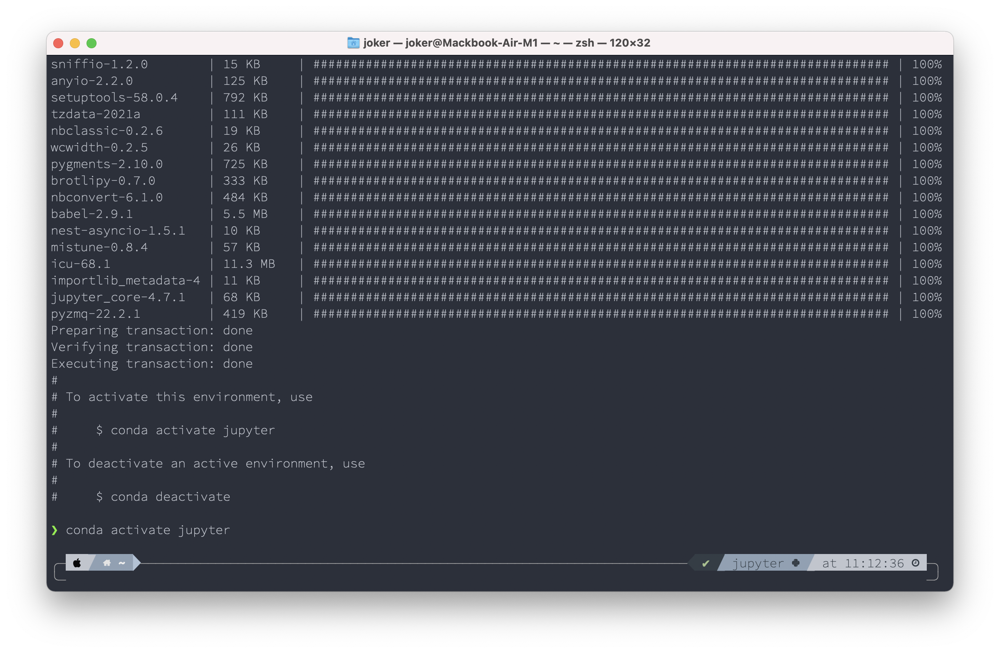

# Jupyterlab

我写《自学是门手艺》的时候，就是用 Jupyterlab 写的 —— 因为在写作的过程中要确保所有的代码都是真正能够正确执行的。在没有 Jupyterlab 之前，写一本编程书籍出版之后，读者们几乎必然会遇到「压根就无法正确执行」的代码 —— 读者苦恼，作者其实更苦恼，谁想写出来卖出去的是垃圾呢？

用 Jupyterlab 还可以极方便地编写一些短程序，测试并使用 —— 不仅仅是 Python…… 不过，我在 Jupyterlab 上还真的基本上只用 Python。

-----
**⚠️ 注意**：[Jupyter-Desktop](https://github.com/jupyterlab/jupyterlab-desktop) 已经发行一段时间了，有人觉得它不稳定，我用了一段时间觉得没什么问题。

```bash
brew install --cask jupyterlab
```
-----


Jupyterlab 是个「服务器端」软件，只提供一个 WebUI，用浏览器访问。这也有点讨厌，因为你经常一不小心就彻底退出浏览器，相当于是不小心就把某个正在工作中的 Jupyterlab 给关掉了。在 MacOS 上运行 Jupyterlab 还有另外一个强迫症患者受不了的地方 —— 你得保持一个 Terminal 窗口开着…… 同样，你经常会一不小心就退出了整个 Terminal，导致 Jupyterlab「被迫退出」。

于是，要折腾一番，才能让这个神器 Jupyterlab 妥帖地听话……

## 1. 安装 Miniconda

```bash
brew install miniconda
```

如果遇到错误提示说 `... Bad CPU type in executable`（如果你用的是苹果最新 M1 芯片的电脑，可能会这样），那么就用以下命令：

```
softwareupdate --install-rosetta
arch -x86_64 brew install miniconda
```

安装完毕之后，执行以下两条命令：

```bash
conda init "$(basename "${SHELL}")"
exec zsh
```

> miniconda 的安装脚本，是在最开头提醒你的：
>
> ```shell
> ==> Caveats
> Please run the following to setup your shell:
>   conda init "$(basename "${SHELL}")"
> ```
>
> 可后来的消息很快滚了两屏之后，你「好像是没有看到一样」—— 所以，以后得养成好习惯：
>
> > 耐下性子浏览一遍那些「天书」一样的消息……

而后，你可以用 `which conda` 命令看看安装是否成功。如果成功，你会看到这样一串消息：

```bash
conda () {
	\local cmd="${1-__missing__}"
	case "$cmd" in
		(activate | deactivate) __conda_activate "$@" ;;
		(install | update | upgrade | remove | uninstall) __conda_exe "$@" || \return
			__conda_reactivate ;;
		(*) __conda_exe "$@" ;;
	esac
}
```

以后，你可以用 `brew upgrade miniconda` 保持 Miniconda 处于最新状态。

## 2. 为 Jupyterlab 创建一个虚拟环境

作为新手，先别管啥叫「虚拟环境」，只管先照着做就是了。

```bash
conda create -n jupyter python ipython jupyterlab nodejs
conda activate jupyter
```



如果你的 Terminal 安装过 Powerlevel10K Theme，那么，命令行的提示符，会提醒你当前处于 jupyter 这个虚拟环境之中……

现在可以测试一下 Jupyterlab 了：

```bash
jupyter lab
```

稍等片刻，浏览器会自动打开，向你展示 Jupyterlab 的 WebUI……

在 Terminal 中用快捷键 `⌃ c`（Control 和 c）终止当前正在运行的程序。

## 3. 创建一个配置文件

```bash
jupyter notebook --generate-config
```

生成的配置文件保存在 `./jupyter/` 文件夹中，用 Sublime Text 打开 `jupyter_server_config.json` （当然，你用系统自带的免费的但愚蠢的 Text Edit 也行），把 `password` 改成空字符串：

```json
{
  "ServerApp": {
    "password": ""
  }
}
```

以上步骤也可以用 `echo` 命令替代：

```bash
cat <<EOF > $HOME/.jupyter/jupyter_server_config.json
{
  "ServerApp": {
    "password": ""
  }
}
EOF
```

## 4. 创建两个服务文件

第一个文件

```bash
subl /opt/homebrew/bin/jupyterservice
```

拷贝粘贴以下内容到这个文件，并保存：

```shell
#!/bin/zsh
PATH="/opt/homebrew/Caskroom/miniconda/base/bin:$PATH"
eval "$(conda 'shell.zsh' hook)"
conda activate jupyter
cd ~
/opt/homebrew/Caskroom/miniconda/base/envs/jupyter/bin/python -m jupyter lab --no-browser
```

以上两个步骤也可以用 `echo` 命令替代：

```bash
cat <<EOF > /opt/homebrew/bin/jupyterservice
#!/bin/zsh
PATH="/opt/homebrew/Caskroom/miniconda/base/bin:$PATH"
eval "$(conda 'shell.zsh' hook)"
conda activate jupyter
cd ~
/opt/homebrew/Caskroom/miniconda/base/envs/jupyter/bin/python -m jupyter lab --no-browser
EOF
```

然后再执行一条命令

```bash
chmod +x /opt/homebrew/bin/jupyterservice
```

第二个文件

```
subl ~/Library/LaunchAgents/com.jupyter.lab.plist
```

拷贝粘贴以下内容到这个文件，并保存：

```xml
<?xml version="1.0" encoding="UTF-8"?>
<!DOCTYPE plist PUBLIC "-//Apple//DTD PLIST 1.0//EN" "http://www.apple.com/DTDs/PropertyList-1.0.dtd">
<plist version="1.0">
<dict>
	<key>Label</key>
	<string>local.job</string>
	<key>ProgramArguments</key>
	<array>
		<string>/opt/homebrew/bin/jupyterservice</string>
	</array>
	<key>RunAtLoad</key>
	<true/>
	<key>StandardErrorPath</key>
	<string>/tmp/local.job.err</string>
	<key>StandardOutPath</key>
	<string>/tmp/local.job.out</string>
</dict>
</plist>
```

以上两个步骤也可以用 `echo` 命令替代：

```bash
cat <<EOF >~/Library/LaunchAgents/com.jupyter.lab.plist
<?xml version="1.0" encoding="UTF-8"?>
<!DOCTYPE plist PUBLIC "-//Apple//DTD PLIST 1.0//EN" "http://www.apple.com/DTDs/PropertyList-1.0.dtd">
<plist version="1.0">
<dict>
	<key>Label</key>
	<string>local.job</string>
	<key>ProgramArguments</key>
	<array>
		<string>/opt/homebrew/bin/jupyterservice</string>
	</array>
	<key>RunAtLoad</key>
	<true/>
	<key>StandardErrorPath</key>
	<string>/tmp/local.job.err</string>
	<key>StandardOutPath</key>
	<string>/tmp/local.job.out</string>
</dict>
</plist>
EOF
```


## 5. 启动服务

```bash
launchctl load ~/Library/LaunchAgents/com.jupyter.lab.plist
```

如此这般，Jupyterlab 就作为服务在后台运行了，以后每次重新启动的时候它都会跟着静悄悄地自动启动。

现在，你随时可以在任何浏览器中打开网址：`http://localhost:8888` —— 你可以把某个浏览器当作 Jupyter 专用，反正浏览器软件那么多。

如果你想重新启动 Jupyter 服务，那么：

```bash
launchctl unload ~/Library/LaunchAgents/com.jupyter.lab.plist
launchctl load ~/Library/LaunchAgents/com.jupyter.lab.plist
```

如果你想方便一点，不想每次都到这个文档里拷贝粘贴命令，那么，在 `~/.zshrc` 文件末尾添加如下几行：

```shell
# for jupyter
alias jpu="launchctl unload ~/Library/LaunchAgents/com.jupyter.lab.plist"
alias jpl="launchctl load ~/Library/LaunchAgents/com.jupyter.lab.plist"
alias jpr="jpu && jpl"
```

而后通过 `exec zsh` 重新启动 zsh…… 现在，你在 Terminal 里可以使用三个新命令了：

```bash
jpu # 停止 jupyter 服务
jpl # 启动 jupyter 服务
jpr # 重启 jupyter 服务
```

这下你学会了，`alias` 就是「自定义缩写」。`exec zsh` 实在太常用了，想不想少敲些字符呢？我想。于是，我的 `~/.zshrc` 文件里就多了两行：

```bash
alias zsr="exec zsh" # 重新启动 zsh
alias zs="subl ~/.zshrc" # 用 sublimetext 打开 ~/.zshrc 文件
```

## 6. 干脆打包个 App

有个基于 Nodejs 的程序，可以把 Web 服务打包成本地 APP，叫做 [Nativefier](https://github.com/jiahaog/nativefier)。

```bash
conda activate jupyter
npm install nativefier -g
cd ~/Applications
curl https://github.com/xiaolai/apple-computer-literacy/raw/main/images/jupyterlab-app-icon.png --output jupyterlab-app-icon.png
nativefier "http://localhost:8888" -i jupyterlab-app-icon.png
rm jupyterlab-app-icon.png
```

终于，以后我可以这样用 Jupyterlab 了……

